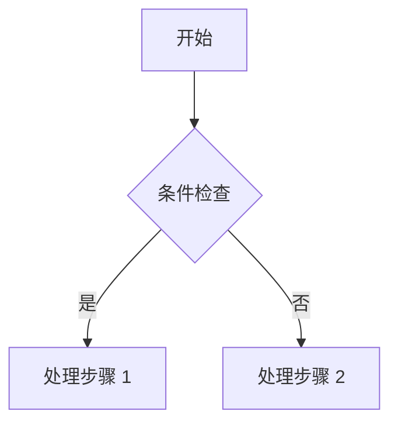

# Firefly Mermaid Compatibility Evidence

## Baseline

- Repository: `https://github.com/mei-ou/Firefly.git`
- Branch selected for the deployed syntax baseline: `test`
- Commit: `25006af903b9ef067963981ac51cb39aae431036`
- Firefly: `6.15.8`
- Astro: `7.2.0`
- `@mermanjs/web`: `0.8.0-alpha.3`
- Light theme: `editor-light`
- Dark theme: `editor-dark`

The local commits after upstream `dd48f0b240aafd19ebba0b4e0812de3cc23be75a` do not change Mermaid parsing, rendering, styles, or article syntax.

## Real Source Syntax

The pinned repository uses lowercase `mermaid` as the info string of a fenced Markdown code block:

````markdown

````

`remarkMermaid` only recognizes code nodes whose `lang` is exactly lowercase `mermaid`. A `Mermaid` fence remains an ordinary code block. CommonMark tilde fences with lowercase `mermaid` also reach the same code-node contract and render successfully, but no matching real article source was found.

## Real Diagram Coverage

`src/content/posts/markdown-mermaid.md` contains 14 deployed diagram forms:

1. `graph TD`
2. `sequenceDiagram`
3. `erDiagram`
4. `classDiagram`
5. `stateDiagram-v2`
6. `xychart-beta`
7. `pie showData`
8. `gantt`
9. `mindmap`
10. `timeline`
11. `journey`
12. `gitGraph`
13. `kanban`
14. `sankey-beta`

Every block was extracted from the pinned article and rendered independently with the pinned Firefly processor. All 14 produced both light and dark static SVG output, none used the error fallback, and none contained a script element or `javascript:` URL.

This list is compatibility evidence, not an Admin grammar allowlist. Merman remains the authority on whether a particular Mermaid source is valid.

## Build-Time Rendering Pipeline

The active plugin order is:

1. `remarkMermaid` runs near the end of the remark phase. It changes an exact lowercase Mermaid code node to a `div.mermaid-container`, stores the original source in `data-mermaid-code`, and keeps a text child for MDX compatibility.
2. `rehypeMermaid` runs after KaTeX, Callouts, slugging, and code groups.
3. It initializes the local Merman WASM module from the installed package and renders two SVG documents at build time.
4. The light SVG uses `editor-light`; the dark SVG uses `editor-dark`.
5. `assertSafeSvgForDom` checks both SVG strings before insertion.
6. The plugin removes an inline SVG `max-width` constraint and inserts both static SVG variants into the article tree.
7. CSS selects the appropriate SVG for the current page theme.

Normal article viewing does not load a Mermaid renderer or execute Mermaid source in the browser.

## Failure And Safety Contract

If parsing, rendering, or the SVG safety assertion throws, Firefly does not fail the whole Markdown document. The node becomes a Mermaid error panel containing a plain-text fallback of the original source. The fallback is inserted through HAST text nodes rather than raw HTML.

Pinned boundary probes established:

- malformed Mermaid syntax uses the escaped source fallback;
- an initialization directive requesting a loose security level uses the fallback;
- an HTML `<script>` label uses the fallback;
- a `click` statement containing a `javascript:` target can still produce static SVG, but the checked output contains neither `javascript:` nor a script element;
- uppercase `Mermaid` remains ordinary highlighted code instead of entering the Mermaid renderer.

The browser-side diagram script is Firefly-owned code injected after the diagrams are built. It only provides pan, zoom, reset, and fullscreen interaction over existing SVG or image elements. No `fetch`, XHR, WebSocket, dynamic Mermaid rendering, source evaluation, or HTML insertion was found in that script.

## Admin V0 Contract

Mermaid remains an inert, source-preserving placeholder in the visual editor:

- recognize only a fenced code node whose info string is exactly lowercase `mermaid`;
- preserve fence character, fence length, whitespace, line endings, info string, and diagram body while untouched;
- do not parse Mermaid semantics in Admin V0;
- do not import Merman WASM or render SVG in the editing canvas;
- do not insert Firefly-generated SVG into the editor document;
- do not run diagram pan/zoom code in the editor placeholder;
- keep invalid Mermaid as a recognized placeholder with a diagnostic when the fence is unambiguous;
- keep malformed Markdown fence boundaries opaque;
- serialize canonical Mermaid source only after the user edits a recognized placeholder.

Recognizing the fence does not certify that the diagram will render. Firefly's pinned build pipeline remains the final renderer and safety authority.

## Evidence Sources

- `src/content/posts/markdown-mermaid.md:10-333`
- `src/content/posts/encrypted-demo.md:98-105`
- `src/plugins/remark-mermaid.js`
- `src/plugins/rehype-mermaid.mjs`
- `src/plugins/rehype-diagram-panzoom.mjs`
- `src/plugins/diagram-panzoom-script.js`
- `src/plugins/utils/diagramConstants.js`
- `src/config/mermaidConfig.ts`
- `src/types/mermaidConfig.ts`
- `src/styles/markdown-extend.styl:264-345`
- `astro.config.mjs:267-332`
- `package.json` and `pnpm-lock.yaml` entries for `@mermanjs/web@0.8.0-alpha.3`
